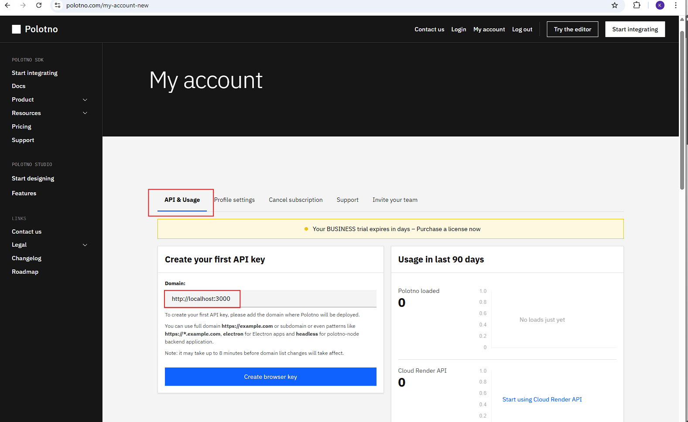
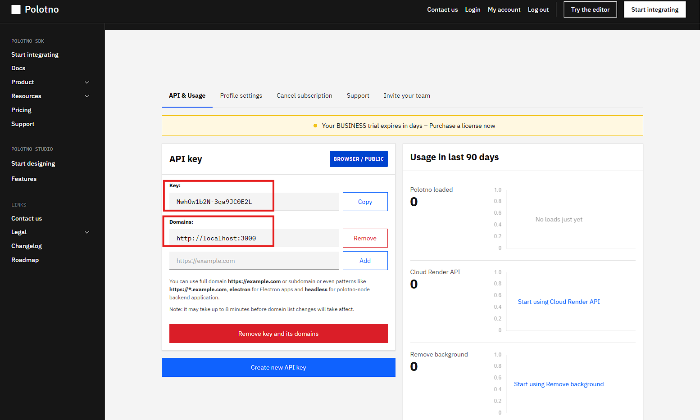
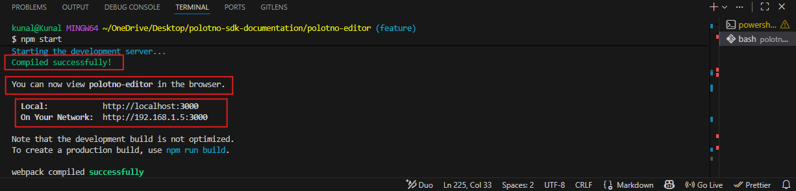
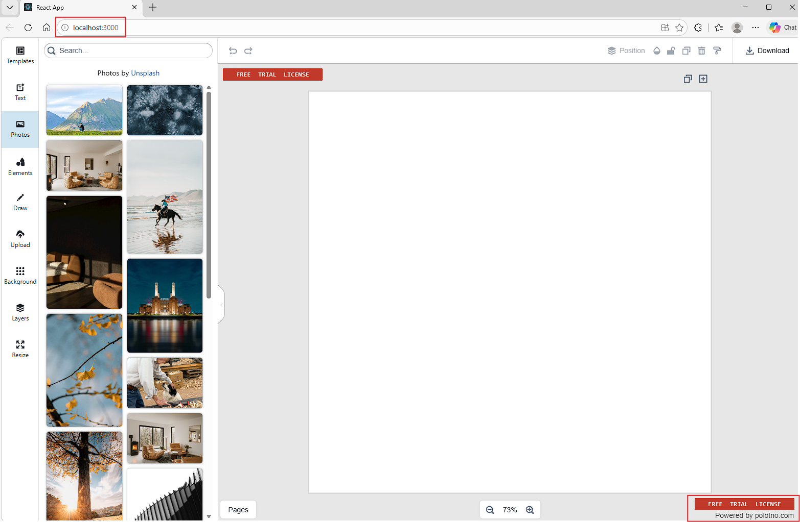
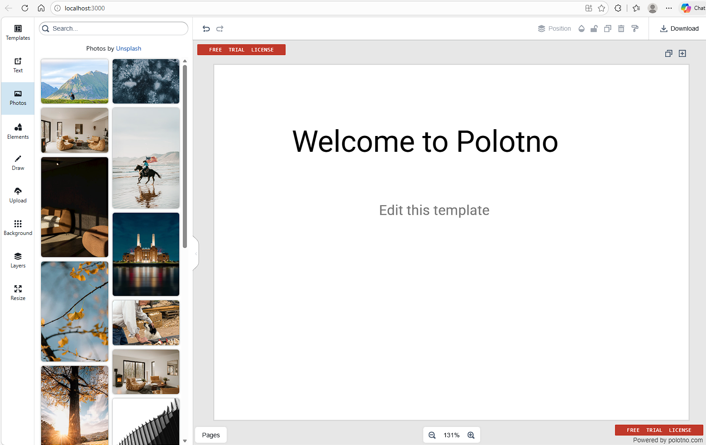
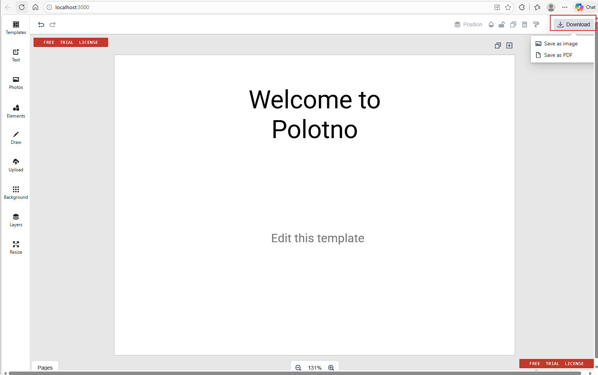
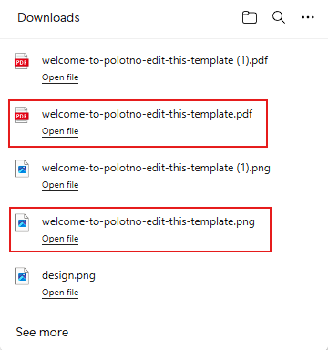
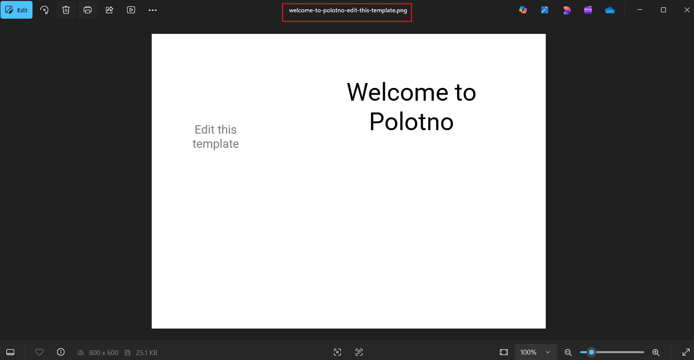
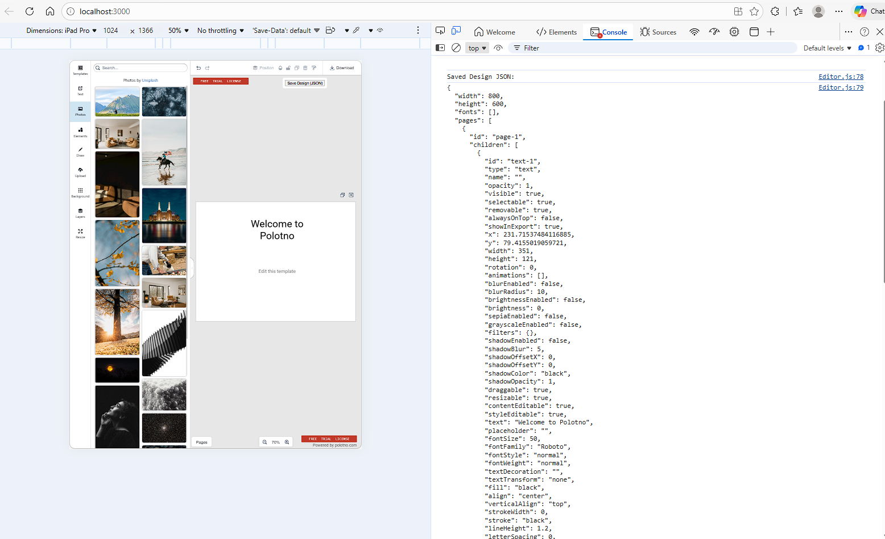
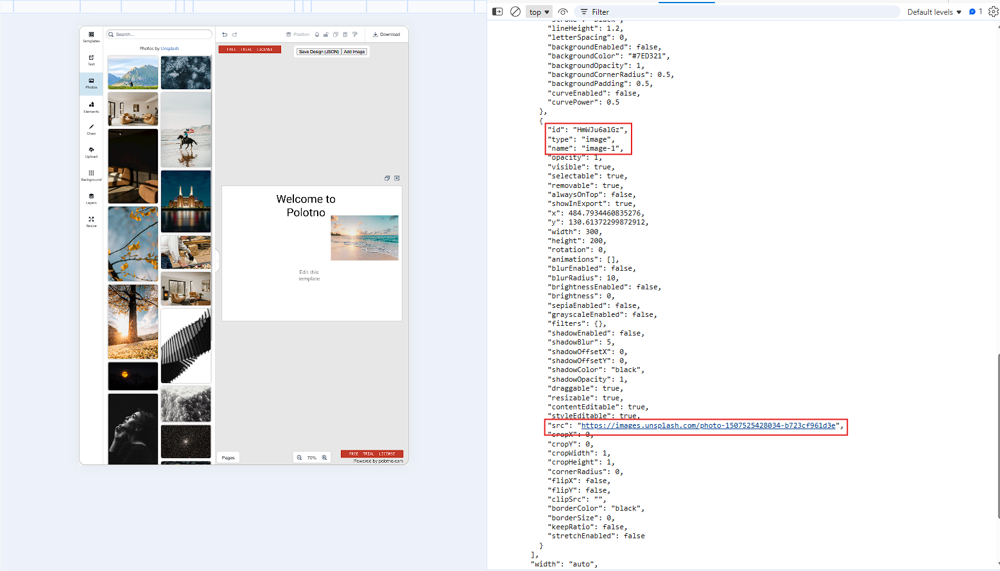

# Embed a design editor in your digital product using Polotno SDK

This guide shows how to embed a working Polotno editor in a React application.

By the end, you will:
- Render the editor
- Load a design
- Export a file
- Save and reload design JSON

You will build a working integration in ~15–20 minutes.

---

**Table of Contents**

- [Embed a design editor in your digital product using Polotno SDK](#embed-a-design-editor-in-your-digital-product-using-polotno-sdk)
  - [Step 1 – Generate your API key](#step-1--generate-your-api-key)
    - [How to get your API key](#how-to-get-your-api-key)
      - [Create your API key](#create-your-api-key)
    - [What this key does?](#what-this-key-does)
    - [Note](#note)
  - [Step 2 – Install the SDK](#step-2--install-the-sdk)
    - [Run These Commands](#run-these-commands)
    - [React 19 Compatibility Issue](#react-19-compatibility-issue)
      - [Recommended Fix (Official Approach)](#recommended-fix-official-approach)
    - [Checkpoint](#checkpoint)
  - [Step 3 – Render the editor](#step-3--render-the-editor)
    - [Create an Editor.js file](#create-an-editorjs-file)
    - [Update App.js file](#update-appjs-file)
    - [Run the app](#run-the-app)
    - [Checkpoint](#checkpoint-1)
  - [Step 4: Load a Design Template](#step-4-load-a-design-template)
    - [Update the Editor component](#update-the-editor-component)
    - [Checkpoint](#checkpoint-2)
  - [Step 5: Export a Design](#step-5-export-a-design)
    - [Where the export option appears](#where-the-export-option-appears)
    - [What happens on export](#what-happens-on-export)
    - [Checkpoint — Export Your Design](#checkpoint--export-your-design)
  - [Step 6: Save Design State](#step-6-save-design-state)
    - [Why save JSON instead of images](#why-save-json-instead-of-images)
    - [Get JSON Design from Editor](#get-json-design-from-editor)
    - [Send JSON to your backend](#send-json-to-your-backend)
      - [Request / Response Example](#request--response-example)
    - [Reloading the saved design](#reloading-the-saved-design)
  - [Step 7 – Handle Assets and Storage](#step-7--handle-assets-and-storage)
    - [Upload Image -\> Get URL](#upload-image---get-url)
      - [Backend Response](#backend-response)
      - [Load the asset into the editor](#load-the-asset-into-the-editor)
    - [What gets stored in JSON](#what-gets-stored-in-json)
    - [How assets work in Polotno](#how-assets-work-in-polotno)
    - [Standard asset workflow](#standard-asset-workflow)
    - [Checkpoint](#checkpoint-3)
  - [Conclusion](#conclusion)
  - [Next steps](#next-steps)
  
---

## Step 1 – Generate your API key

Before you can use the Polotno SDK, you need an API key. This key is used to initialize the editor and enable SDK features in your application.

---

### How to get your API key

Navigate to the dashboard. Start from the Polotno homepage and access your account:

- Click **Start integrating** or **log in**
- Once you are logged in, open the **My account** section from the top navigation

---

#### Create your API key

Inside the account dashboard, go to the **API & Usage** section. You will see a panel titled **Create your first API key**.

**Steps:**

- Enter your application domain
    - Example: `http://localhost:3000` (for local development)



- Click **Create browser key**



- Copy the generated API key

---

### What this key does?

The API key is required when creating the Polotno store. It authenticates your application and enables the editor to function correctly.

You will use this key in the next step when initializing the SDK.

---

### Note

- The domain is required because Polotno restricts usage to allowed origins
- For local development, always use `http://localhost:<port>`
- It may take a few minutes for domain changes to take effect

---

## Step 2 – Install the SDK

Polotno is used inside a React application. You only need a minimal setup to get started.

---

### Run These Commands


```bash
npx create-react-app polotno-editor
cd polotno-editor
npm install polotno
npm start
```

Your app should compile without errors



---

### React 19 Compatibility Issue

If you're using React 19, you may run into this error while installing Polotno:

```bash
npm ERR! ERESOLVE unable to resolve dependency tree
npm ERR! peer react@"^18.2.0" from polotno
```

---

#### Recommended Fix (Official Approach)

Polotno provides a workaround using package overrides to make it compatible with React 19.

Run the following command:

```bash
npm pkg set "overrides.polotno.react=^19" \
"overrides.polotno.react-dom=^19" \
"overrides.polotno.react-konva=^19.0.3"
```

Install dependencies: `npm install polotno`

Restart development server: `npm start`

### Checkpoint

Your app should start at: `http://localhost:3000`

If you see a React app running, you are ready for the next step.

---

Next, you will load a design into the editor.

---

## Step 3 – Render the editor

### Create an Editor.js file

- Under your `polotno-editor` directory, locate the `src` folder. 
- In the src folder, add a file, and name it `Editor.js`. 

Add the following code inside your `Editor.js` file. 

```js
//Editor.js
import React from 'react';
import { PolotnoContainer, SidePanelWrap, WorkspaceWrap } from 'polotno';
import { Toolbar } from 'polotno/toolbar/toolbar';
import { PagesTimeline } from 'polotno/pages-timeline';
import { ZoomButtons } from 'polotno/toolbar/zoom-buttons';
import { SidePanel } from 'polotno/side-panel';
import { Workspace } from 'polotno/canvas/workspace';

import '@blueprintjs/core/lib/css/blueprint.css';

import { createStore } from 'polotno/model/store';

const store = createStore({
  key: 'MwhOw1b2N-3qa9JC0E2L', // you can create it here: https://polotno.com/cabinet/
  // you can hide back-link on a paid license
  // but it will be good if you can keep it for Polotno project support
  showCredit: true,
});

const page = store.addPage();

export const Editor = () => {
  return (
    <PolotnoContainer style={{ width: '100vw', height: '100vh' }}>
      <SidePanelWrap>
        <SidePanel store={store} />
      </SidePanelWrap>
      <WorkspaceWrap>
        <Toolbar store={store} downloadButtonEnabled />
        <Workspace store={store} />
        <ZoomButtons store={store} />
        <PagesTimeline store={store} />
      </WorkspaceWrap>
    </PolotnoContainer>
  );
};
```

---

### Update App.js file

Modify your `App.js` 

```js
//App.js
import React from "react";
import { Editor } from "./Editor";

function App() {
  return <Editor />;
}

export default App;
```

---

### Run the app

`npm start`

Once your development server starts, you will see the Polotno Design Editor working in your browser. 



---

### Checkpoint

By this point, you should have:

- A running React app (npm start)
- A fully visible Polotno editor in the browser
- Ability to:
  - Add elements (text, images, shapes)
  - Move and resize objects
  - Switch pages 
- A working Polotno store controlling your editor state

## Step 4: Load a Design Template

At this stage, your editor is running, but it starts with an empty canvas. To make it useful, you need to load a design into it.

Paste the following JSON into your `Editor.js` and load it.

```js
// ✅ Sample Design JSON (Template)
const designJSON = {
  width: 800,
  height: 600,
  pages: [
    {
      id: 'page-1',
      children: [
        {
          id: 'text-1',
          type: 'text',
          text: 'Welcome to Polotno',
          x: 80,
          y: 100,
          fontSize: 50,
          fill: 'black',
        },
        {
          id: 'text-2',
          type: 'text',
          text: 'Edit this template',
          x: 80,
          y: 180,
          fontSize: 24,
          fill: 'gray',
        },
      ],
    },
  ],
};
```

---

### Update the Editor component

Replace your existing Editor component with the following:

```js
export const Editor = () => {
  // ✅ Load template when component mounts
  useEffect(() => {
    store.loadJSON(designJSON);
  }, []);

  return (
    <PolotnoContainer style={{ width: '100vw', height: '100vh' }}>
      <SidePanelWrap>
        <SidePanel store={store} />
      </SidePanelWrap>

      <WorkspaceWrap>
        <Toolbar store={store} downloadButtonEnabled />
        <Workspace store={store} />
        <ZoomButtons store={store} />
        <PagesTimeline store={store} />
      </WorkspaceWrap>
    </PolotnoContainer>
  );
};
```

Restart your development server using `npm start`. 

You will see a pre-loaded design rendered directly on the canvas with two texts on the canvas:
- Welcome to Polotno
- Edit this template



---

### Checkpoint

You should now see:
- A pre-loaded design on the canvas
- Text: "Welcome to Polotno"
- Text: "Edit this template"

If the canvas is empty:
- Ensure `store.loadJSON(designJSON)` is inside `useEffect`
- Restart the app using `npm start`

## Step 5: Export a Design

Use the download button in the toolbar to export your design as an image or PDF.

---

### Where the export option appears

In the editor UI:

- The Download button appears in the top-right toolbar
- Clicking it opens export options
- Users can choose format (image or PDF)



---

### What happens on export

- The editor converts the current canvas into:
  - Image (PNG/JPEG), or
  - PDF
- The file is automatically downloaded in the browser





---

### Checkpoint — Export Your Design
By the end of this step, you will have your design exported either as an `image` or a `PDF` file, based on your choice at the time of exporting. 

If you are not able to see the `Download` option, or if you are unable to export your design, ensure, you have the following line in your `Editor.js` file : 
```js
<Toolbar store={store} downloadButtonEnabled />
``` 

## Step 6: Save Design State

Up to this point, users can load and export designs. However, if you want users to return and continue editing later, you need to store the design state.

The editor state can be saved as JSON and reloaded later.

### Why save JSON instead of images

- **JSON** : editable (can be reloaded into the editor)
- **Image/PDF** : final output (not editable)

---

### Get JSON Design from Editor

Use store.toJSON() to extract the current state. Add the following to your `Editor` component. 

```js
const saveDesign = () => {
    const json = store.toJSON();

    // Pretty print for clean screenshot
    console.log('Saved Design JSON:');
    console.log(JSON.stringify(json, null, 2));
  };
```

Replace the `return` function with:

```js
return (
        <>
            <div
                style={{
                position: 'fixed',
                top: 60,
                right: 120,
                zIndex: 9999,
                background: 'white',
                padding: '8px',
                borderRadius: '6px',
                }}
            >
                <button onClick={saveDesign}>Save Design (JSON)</button>
            </div>
            <PolotnoContainer style={{ width: '100vw', height: '100vh' }}>
            <SidePanelWrap>
                <SidePanel store={store} />
            </SidePanelWrap>
            <WorkspaceWrap>
                <Toolbar store={store} downloadButtonEnabled />
                <Workspace store={store} />
                <ZoomButtons store={store} />
                <PagesTimeline store={store} />
            </WorkspaceWrap>
            </PolotnoContainer>
        </>  
    );
```



This returns the full design structure, including:
- canvas size
- pages
- elements (text, images, etc.)
- styles and positions


---

### Send JSON to your backend

```js
const saveDesign = async () => {
  const json = store.toJSON();

  await fetch('/api/save-design', {
    method: 'POST',
    headers: {
      'Content-Type': 'application/json',
    },
    body: JSON.stringify({
      design: json,
    }),
  });
};
```

#### Request / Response Example

Request (Frontend → Backend):

`POST /api/save-design`
```json
{
  "design": { ...JSON }
}
```

Response:

```json
{
  "design-id": "design_123"
}
```

---

### Reloading the saved design

When the user opens the design again:

```js
const response = await fetch('/api/get-design/{design-id}');
const data = await response.json();

store.loadJSON(data.design);
```

---

## Step 7 – Handle Assets and Storage

Polotno does not store files. You must upload assets (images, logos) to your backend and return a public URL.

---

### Upload Image -> Get URL

Send the file to your backend:

```js
const handleUpload = async (file) => {
  const formData = new FormData();
  formData.append('file', file);

  const response = await fetch('/api/upload', {
    method: 'POST',
    body: formData,
  });

  const data = await response.json();

  return data.url; // public URL from backend
};
```

#### Backend Response

Your backend (Node, Spring Boot, etc.):
- Uploads file to storage (e.g., S3, Cloudinary, GCP)
- Returns a public URL

Example response:

```json
{
  "url": "https://your-cdn.com/uploads/image.png"
}
```

#### Load the asset into the editor

Once you have the URL, add it to the canvas:

```js
const addImageFromURL = () => {
        const page = store.activePage;

        const imageURL =
            'https://images.unsplash.com/photo-1507525428034-b723cf961d3e';

        page.addElement({
            type: 'image',
            src: imageURL,
            x: 100,
            y: 150,
            width: 300,
            height: 200,
        });
    };
```

**Add a Button**

```js
<button onClick={addImageFromURL}>Add Image</button>
```

Save your changes, and run `npm start` command in your terminal to re-start your development server. 

Once you click on **Add Image** button, you will see the image is added into the page. 

### What gets stored in JSON

When you save the design:

```json
{
  "type": "image",
  "src": "https://images.unsplash.com/photo-1507525428034-b723cf961d3e"
}
```



**The editor stores only the URL, not the file.**

---

### How assets work in Polotno

- The editor does not upload or persist files
- It only renders assets using a URL
- You are responsible for storing and serving those files

---

### Standard asset workflow

In Polotno, asset handling follows this flow:

```

User uploads image
        ↓
Frontend sends file to backend
        ↓
Backend stores file (S3 / Cloud / Storage)
        ↓
Backend returns public URL
        ↓
Editor loads image using that URL

```

---

### Checkpoint

**Click Add Image**

You should now see:
- An image added to the canvas

**Click Save Design**

In the console, you should see:
- "type": "image"
- "src" with your image URL

---

## Conclusion

You now have a working Polotno integration inside a React application.

In this guide, you:
- Rendered the editor using your API key
- Loaded a design using JSON state
- Exported designs as images or PDFs
- Saved design state for future editing
- Understood how assets are handled via external storage

At this point, you have a complete end-to-end flow:
`Editor → Design JSON → Backend → Reload → Export`

This is the core foundation behind most real-world design editors built with Polotno.

---

## Next steps

Once this basic setup is working, most applications extend it with additional capabilities:

**Template libraries** →
Provide users with predefined designs they can select and customize

**Asset management systems** →
Allow users to upload, organize, and reuse images, logos, and media

**Backend-driven design loading** →
Store multiple designs per user and load them dynamically

**Production export pipelines** →
Move exports to backend services for batch processing or automation

These features build directly on top of the same concepts covered in this guide—design JSON, asset URLs, and programmatic exports.

Start by integrating one of these based on your product’s needs, and iterate from there.