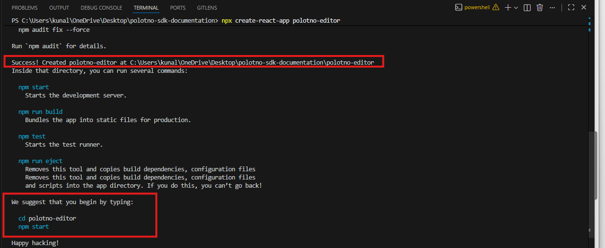
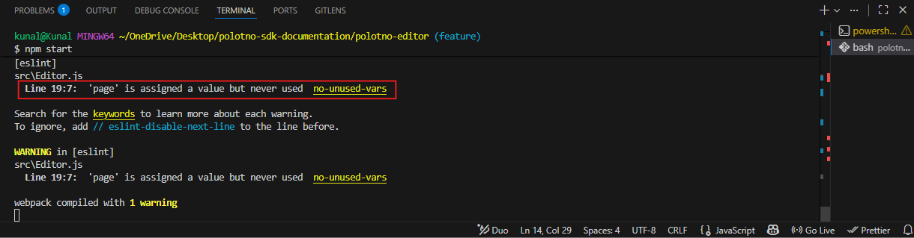

# Embed a design editor in your digital product using Polotno SDK

Many modern applications—from SaaS tools to AI platforms—require built-in design capabilities. Whether it's generating social media creatives, editing documents, or customizing visuals, users increasingly expect these features to exist directly inside the product.

Polotno SDK allows developers to embed a full-featured design editor into their applications without building one from scratch. However, after generating an API key, many developers face a gap: how to move from setup to a working editor with real data flow.

This guide focuses on closing that gap.

By the end of this article, you will have a working embedded editor inside a React application. You will understand how to load and export designs, how design state is structured, and how assets (such as images) are handled and stored.

The goal is not to explain every feature of Polotno, but to give you a clear, linear path to a working integration.

---

**Table of Contents**

- [Embed a design editor in your digital product using Polotno SDK](#embed-a-design-editor-in-your-digital-product-using-polotno-sdk)
  - [What you will build](#what-you-will-build)
  - [Step 1 – Generate your API key](#step-1--generate-your-api-key)
    - [How to get your API key](#how-to-get-your-api-key)
      - [Create your API key](#create-your-api-key)
    - [What this key does?](#what-this-key-does)
    - [Important notes](#important-notes)
  - [Step 2 – Install the SDK](#step-2--install-the-sdk)
    - [Prerequisites: Node.js \& React Setup](#prerequisites-nodejs--react-setup)
    - [Install dependencies](#install-dependencies)
    - [React 19 Compatibility Issue (Important)](#react-19-compatibility-issue-important)
      - [Why this happens](#why-this-happens)
      - [Recommended Fix (Official Approach)](#recommended-fix-official-approach)
      - [What this does](#what-this-does)
    - [Create a React app (if you don’t have one)](#create-a-react-app-if-you-dont-have-one)
      - [Step 1: Create React App using NPM](#step-1-create-react-app-using-npm)
      - [Step 2: Change Directory to `polotno-editor`](#step-2-change-directory-to-polotno-editor)
      - [Step 3: Install Polotno SDK](#step-3-install-polotno-sdk)
      - [Step 4: Start](#step-4-start)
    - [What you installed](#what-you-installed)
    - [Quick sanity check](#quick-sanity-check)
    - [Summary](#summary)
  - [Step 3 – Render the editor](#step-3--render-the-editor)
    - [Create the editor setup](#create-the-editor-setup)
      - [Create an Editor.js file](#create-an-editorjs-file)
      - [Update App.js file](#update-appjs-file)
    - [Run the app](#run-the-app)
    - [ESLint Warning: "variable is assigned a value but never used"](#eslint-warning-variable-is-assigned-a-value-but-never-used)
  - [Step 4: Load a Design Template](#step-4-load-a-design-template)
    - [What is a design JSON?](#what-is-a-design-json)
      - [Key Parts](#key-parts)
    - [Load A Design Into The Editor](#load-a-design-into-the-editor)
    - [Example: Load a Template](#example-load-a-template)
    - [Important : Add `id` fields](#important--add-id-fields)
  - [Step 5: Export a Design](#step-5-export-a-design)
    - [Use the built-in download button](#use-the-built-in-download-button)
    - [Where the export option appears](#where-the-export-option-appears)
    - [What happens on export](#what-happens-on-export)
    - [Implement Custom Download Links and Buttons](#implement-custom-download-links-and-buttons)
      - [Export as an Image](#export-as-an-image)
      - [Export as a PDF](#export-as-a-pdf)
      - [Triggers](#triggers)
  - [Step 6: Save Design State](#step-6-save-design-state)
    - [Why save JSON instead of images](#why-save-json-instead-of-images)
    - [Get JSON Design from Editor](#get-json-design-from-editor)
    - [Send JSON to your backend](#send-json-to-your-backend)
    - [Reloading the saved design](#reloading-the-saved-design)
  - [Step 7 – Handle assets and storage](#step-7--handle-assets-and-storage)
    - [How assets work in Polotno](#how-assets-work-in-polotno)
    - [Standard asset workflow](#standard-asset-workflow)
    - [Step-by-Step Example](#step-by-step-example)
      - [User Uploads the Image](#user-uploads-the-image)
      - [Backend Stores the File](#backend-stores-the-file)
      - [Load the asset into the editor](#load-the-asset-into-the-editor)
      - [Add Image](#add-image)
  
---


## What you will build

In this guide, you will build a minimal React application with an embedded Polotno editor.

The final setup will allow you to:

- Render the editor inside your application
- Load a predefined design template
- Modify the design visually
- Export the design as an image or PDF
- Save and reload the design state

The integration is intentionally minimal so you can understand how the core pieces fit together:


- **Editor rendering (frontend)**
- **Design state (JSON)**
- **Asset handling (external storage)**

By the end, you will have a working foundation that you can extend into a production-ready implementation.

---

## Step 1 – Generate your API key

Before you can use the Polotno SDK, you need an API key. This key is used to initialize the editor and enable SDK features in your application.

---

### How to get your API key

Navigate to the dashboard. Start from the Polotno homepage and access your account:

- Click **Start integrating** or **log in**
- Once you are logged in, open the **My account** section from the top navigation

---

#### Create your API key

Inside the account dashboard, go to the **API & Usage** section. You will see a panel titled **Create your first API key**.

**Steps:**

- Enter your application domain
    - Example: `http://localhost:3000` (for local development)


- Click **Create browser key**


- Copy the generated API key

--

### What this key does?

The API key is required when creating the Polotno store. It authenticates your application and enables the editor to function correctly.

You will use this key in the next step when initializing the SDK.

---

### Important notes

- The domain is required because Polotno restricts usage to allowed origins
- For local development, always use `http://localhost:<port>`
- It may take a few minutes for domain changes to take effect

---

In the next step, you will install the SDK and use this key to render the editor.

---

## Step 2 – Install the SDK

Polotno is used inside a React application. You only need a minimal setup to get started.

---

### Prerequisites: Node.js & React Setup

---

– Node.js (v18+)
– A React application

---

### Install dependencies

Run the following command in your terminal window : `npm install polotno`

---

### React 19 Compatibility Issue (Important)

If you're using React 19, you may run into this error while installing Polotno:

```bash
npm ERR! ERESOLVE unable to resolve dependency tree
npm ERR! peer react@"^18.2.0" from polotno
```

---

#### Why this happens

Polotno is currently built on React 18, so npm detects a version mismatch when your project uses React 19.

---

#### Recommended Fix (Official Approach)

Polotno provides a workaround using package overrides to make it compatible with React 19.

Run the following command:

```
npm pkg set "overrides.polotno.react=^19" \
"overrides.polotno.react-dom=^19" \
"overrides.polotno.react-konva=^19.0.3"
```

Then install dependencies:

`npm install polotno`

---

#### What this does

This forces Polotno to use your project's React 19 version internally, resolving dependency conflicts and preventing runtime errors.

---

### Create a React app (if you don’t have one)

If you do not already have a React application, run the following commands in your terminal window, to create a React app. 

---

#### Step 1: Create React App using NPM

In the terminal window, run the following command. `npx create-react-app polotno-editor`

It will take a few minutes before NPM installs the required packages.



---

#### Step 2: Change Directory to `polotno-editor`

Run the following command in your terminal window: `cd polotno-editor`

---

#### Step 3: Install Polotno SDK

Polotno SDK can be installed using **Node Package Manager**, and all you need to do is run `npm install polotno` in your terminal window. 

**Note**: Ensure, you have changed your working repository to `polotno-editor` before installing Polotno. 

---

#### Step 4: Start

Once Polotno SDK is installed, simply run `npm start`. 

---

### What you installed

- `polotno`: **Editor UI + State Management**

---

### Quick sanity check

After installation:

- Your app should compile without errors


- No extra setup (CSS, config, env vars) is required
- You are ready to render the editor

---

### Summary

For step 2, you need to execute 4 commands in your terminal window. 

- `npx create-react-app polotno-editor`
- `cd polotno-editor`
- `npm install polotno`
- `npm start`

---

Next, you’ll render the editor using the API key and see it running.

---

## Step 3 – Render the editor

Now that the SDK is installed, the next step is to render the Polotno editor inside your application.

At this stage, the goal is simple: **get the editor visible on screen**.

---

### Create the editor setup

---

#### Create an Editor.js file

- Under your `polotno-editor` directory, locate the `src` folder. 
- In the src folder, add a file, and name it `Editor.js` or any name of your choice. Ensure, it is a `.js` file. 

Add the following code inside your Editor.js file. 

```js
import React from 'react';
import { PolotnoContainer, SidePanelWrap, WorkspaceWrap } from 'polotno';
import { Toolbar } from 'polotno/toolbar/toolbar';
import { PagesTimeline } from 'polotno/pages-timeline';
import { ZoomButtons } from 'polotno/toolbar/zoom-buttons';
import { SidePanel } from 'polotno/side-panel';
import { Workspace } from 'polotno/canvas/workspace';

import '@blueprintjs/core/lib/css/blueprint.css';

import { createStore } from 'polotno/model/store';

const store = createStore({
  key: 'MwhOw1b2N-3qa9JC0E2L', // you can create it here: https://polotno.com/cabinet/
  // you can hide back-link on a paid license
  // but it will be good if you can keep it for Polotno project support
  showCredit: true,
});

const page = store.addPage();

export const Editor = () => {
  return (
    <PolotnoContainer style={{ width: '100vw', height: '100vh' }}>
      <SidePanelWrap>
        <SidePanel store={store} />
      </SidePanelWrap>
      <WorkspaceWrap>
        <Toolbar store={store} downloadButtonEnabled />
        <Workspace store={store} />
        <ZoomButtons store={store} />
        <PagesTimeline store={store} />
      </WorkspaceWrap>
    </PolotnoContainer>
  );
};
```

---

#### Update App.js file

After you have added your `Editor.js` file, you need to modify your `App.js` within the same `src` folder. 

```js
import React from "react";
import { Editor } from "./Editor";

function App() {
  return <Editor />;
}

export default App;
```

---

### Run the app

`npm start`

If everything is set up correctly, you should now see the Polotno editor running inside your browser.


---

### ESLint Warning: "variable is assigned a value but never used"

While running the Polotno editor, you may see a warning like: `'page' is assigned a value but never used no-unused-vars`. 



In your code, you may have a line like:

```js
const page = store.addPage();
```

This warning does not break your app, it’s just a code quality hint from ESLint.

---

## Step 4: Load a Design Template

At this stage, your editor is running, but it starts with an empty canvas. To make it useful, you need to load a design into it.

In Polotno, every design is represented as JSON state. This JSON fully describes the canvas including its size, pages, and all elements inside it (text, images, shapes, etc.).

---

### What is a design JSON?

A Polotno design is a structured JSON object that looks like this:

```json
{
  "width": 800,
  "height": 600,
  "pages": [
    {
      "id" : "page-1",
      "children": [
        {
          "id": "text-1",
          "type": "text",
          "text": "Hello Polotno",
          "x": 100,
          "y": 100,
          "fontSize": 40
        }
      ]
    }
  ]
}
```

#### Key Parts

- `width`, `height` : canvas size
- `pages` : array of pages
- `children` : elements inside a page
- Each element has a `type`(text, image, etc.) and it's properties. 

---

### Load A Design Into The Editor

To load a design, use:

```js
store.loadJSON(designJSON);
```

---

### Example: Load a Template

Update your `Editor.js`:

```js
import React, { useEffect } from 'react';
```

Then define a sample design:

```js
const designJSON = {
  width: 800,
  height: 600,
  pages: [
    {
      id: 'page-1', 
      children: [
        {
          id: 'text-1', 
          type: 'text',
          text: 'Welcome to Polotno',
          x: 80,
          y: 100,
          fontSize: 50,
          fill: 'black',
        },
        {
          id: 'text-2',
          type: 'text',
          text: 'Edit this template',
          x: 80,
          y: 180,
          fontSize: 24,
          fill: 'gray',
        },
      ],
    },
  ],
};
```
Now load it when the component mounts:

```js
useEffect(() => {
  store.loadJSON(designJSON);
}, []);
```


---

### Important : Add `id` fields

After compiling your updated `Editor.js` and `App.js` files, if you spot the following error,

```
value undefined is not assignable to type: identifier
```

you need to ensure that you have added the id field to every entity in your JSON body. 

Every page and element in Polotno design JSON must include a unique `id`. If you're creating JSON manually, you need to provide these IDs yourself.

---

## Step 5: Export a Design

Once users finish editing a design, the next step is to export it as a usable output. Polotno provides a built-in export option through its Toolbar, so you don’t need to implement custom logic for basic use cases.

---

### Use the built-in download button

Polotno’s `Toolbar` component includes a download button that allows users to export designs directly.

Update your Toolbar configuration:

```js
Toolbar store={store} downloadButtonEnabled />
```

That’s it. No additional code is required.

---

### Where the export option appears

In the editor UI:

- The Download button appears in the top-right toolbar
- Clicking it opens export options
- Users can choose format (image or PDF)


---

### What happens on export

- The editor converts the current canvas into:
  - Image (PNG/JPEG), or
  - PDF
- The file is automatically downloaded in the browser


No backend or additional setup is required.

---

### Implement Custom Download Links and Buttons

If you need more control (for example, uploading files to your backend), you can export designs programmatically.

---

#### Export as an Image

You can export the current canvas as a high-quality image using `store.toDataURL()`.

```js
const exportImage = async () => {
  const dataURL = await store.toDataURL({
    pixelRatio: 2, // increase for higher resolution
  });

  // trigger download
  const link = document.createElement('a');
  link.href = dataURL;
  link.download = 'design.png';
  link.click();
};
```

---

#### Export as a PDF

```js
const exportPDF = async () => {
  await store.saveAsPDF({
    fileName: 'design.pdf',
  });
};
```

---

#### Triggers

```js
<button onClick={exportImage}>Export Image</button>
<button onClick={exportPDF}>Export PDF</button>
```

This converts the canvas into a base64 image (dataURL), which you can download or send to your backend.

---

## Step 6: Save Design State

Up to this point, users can load and export designs. However, if you want users to return and continue editing later, you need to store the design state.

In Polotno, the design state is represented as JSON.

### Why save JSON instead of images

- **JSON** : editable (can be reloaded into the editor)
- **Image/PDF** : final output (not editable)

---

### Get JSON Design from Editor

Use store.toJSON() to extract the current state:

```js
const saveDesign = () => {
    const json = store.toJSON();

    // Pretty print for clean screenshot
    console.log('Saved Design JSON:');
    console.log(JSON.stringify(json, null, 2));
  };
```


This returns the full design structure, including:
- canvas size
- pages
- elements (text, images, etc.)
- styles and positions


---

### Send JSON to your backend

In a real application, you send this JSON to your backend or database.

```js
const saveDesign = async () => {
  const json = store.toJSON();

  await fetch('/api/save-design', {
    method: 'POST',
    headers: {
      'Content-Type': 'application/json',
    },
    body: JSON.stringify({
      design: json,
    }),
  });
};
```

---

### Reloading the saved design

When the user opens the design again:

```js
const response = await fetch('/api/get-design/{design-id}');
const data = await response.json();

store.loadJSON(data.design);
```

---

## Step 7 – Handle assets and storage

So far, you’ve worked with text elements and JSON state. In real applications, users will also upload assets such as images, logos, or backgrounds.

Polotno does not store files for you. Instead, it expects assets to be provided as **public URLs**.

---

### How assets work in Polotno

- The editor does not upload or persist files
- It only renders assets using a URL
- You are responsible for storing and serving those files

---

### Standard asset workflow

In a typical application, asset handling follows this flow:

```

User uploads image
        ↓
Frontend sends file to backend
        ↓
Backend stores file (S3 / Cloud / Storage)
        ↓
Backend returns public URL
        ↓
Editor loads image using that URL

```

### Step-by-Step Example

In this example, we simulate asset handling by adding an image using a public URL. When the design is saved, the image is stored as a src reference in the JSON, confirming that Polotno works with asset URLs rather than storing files directly.

#### User Uploads the Image

You capture the file from an input:

```js
const handleUpload = async (file) => {
  const formData = new FormData();
  formData.append('file', file);

  const response = await fetch('/api/upload', {
    method: 'POST',
    body: formData,
  });

  const data = await response.json();

  return data.url; // public URL from backend
};
```

#### Backend Stores the File

Your backend (Node, Spring Boot, etc.):
- Uploads file to storage (e.g., S3, Cloudinary, GCP)
- Returns a public URL

Example response:

```json
{
  "url": "https://your-cdn.com/uploads/image.png"
}
```

#### Load the asset into the editor

Once you have the URL, add it to the canvas:

```js
const addImageFromURL = () => {
        const page = store.activePage;

        const imageURL =
            'https://images.unsplash.com/photo-1507525428034-b723cf961d3e';

        page.addElement({
            type: 'image',
            src: imageURL,
            x: 100,
            y: 150,
            width: 300,
            height: 200,
        });
    };
```

#### Add Image

To use the above code block to add images into the editor, add this button. 

```js
<button onClick={addImageFromURL}>Add Image</button>
```

Save your changes, and run `npm start` command in your terminal to re-start your devlopment server. 

Once you click on **Add Image** button, you will see the image is added into the page. 

To verify this step: 
- Right click on your homepage. 
- Click on `Inspect` option from the menu. 
- Click on `Console` tab. 
- Click on `Save Design(JSON)` button created in the previous steps. 

You will be able to see that, a thord child element, `image` has been added in the JSON output, with it's unique ID, and image source URL, identical to the one you provided in your code. 

