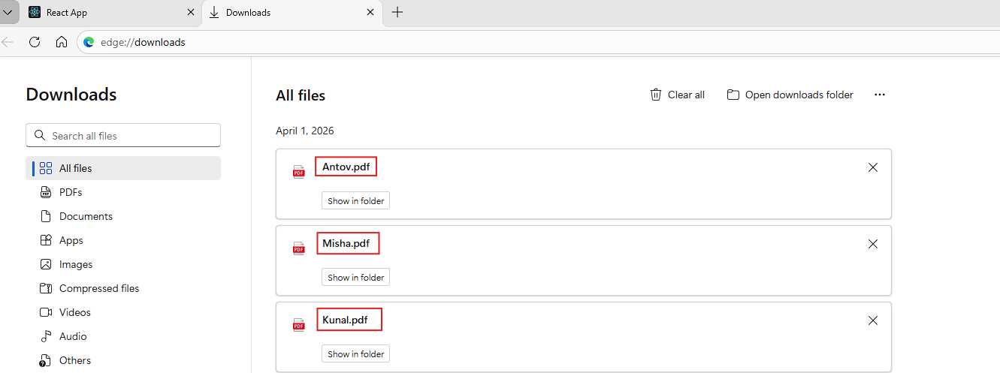
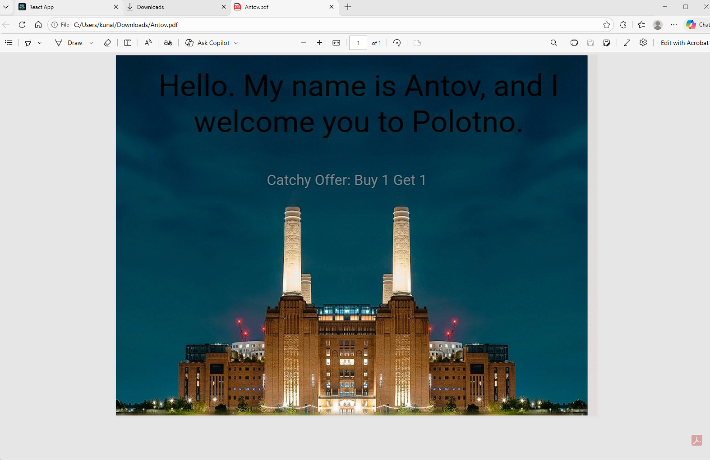

# What is Variable Data Printing (VDP)

Variable Data Printing (VDP) is a **deterministic batch rendering process** where a single template is combined with a structured dataset to generate many print-ready outputs at scale. Each **record** in the dataset produces exactly one output, while specific elements such as text, images, or machine-readable codes change based on the data. The template defines layout, constraints, and styling, while the dataset drives personalization.

Unlike static design workflows, VDP systems operate as **data pipelines**. Inputs are validated, mapped to template variables, and rendered through a controlled process that ensures consistency across thousands or millions of outputs. This makes VDP suitable for production environments where accuracy, repeatability, and traceability are required.

At its core, VDP is not just about inserting dynamic fields into a design but it is about **systematically transforming structured data into compliant, print-ready artifacts** under predefined rules and constraints.

---
- [What is Variable Data Printing (VDP)](#what-is-variable-data-printing-vdp)
    - [Two properties that distinguish VDP from basic templating](#two-properties-that-distinguish-vdp-from-basic-templating)
      - [1. Scale](#1-scale)
      - [2. Determinism](#2-determinism)
    - [What qualifies as a “variable”?](#what-qualifies-as-a-variable)
    - [Typical outputs](#typical-outputs)
  - [When do you need VDP vs regular templates?](#when-do-you-need-vdp-vs-regular-templates)
    - [Use VDP when](#use-vdp-when)
    - [Avoid VDP when](#avoid-vdp-when)
    - [Common triggers (with practical context)](#common-triggers-with-practical-context)
  - [Core concepts (used consistently in production)](#core-concepts-used-consistently-in-production)
    - [1. Template](#1-template)
    - [2. Dataset](#2-dataset)
    - [3. Record](#3-record)
    - [4. Variables](#4-variables)
    - [5. Rules](#5-rules)
      - [Types of rules:](#types-of-rules)
    - [6. Proofing](#6-proofing)
    - [7. Render job](#7-render-job)
  - [End-to-End VDP Pipeline: Implementation using Polotno](#end-to-end-vdp-pipeline-implementation-using-polotno)
    - [Step 1: Collect and Normalize Data](#step-1-collect-and-normalize-data)
    - [Step 2: Design the Template (Safe Areas + Variables)](#step-2-design-the-template-safe-areas--variables)
    - [Step 3: Map Fields to Variables + Formatting Rules](#step-3-map-fields-to-variables--formatting-rules)
    - [Step 4: Proofing (Single + Edge Cases)](#step-4-proofing-single--edge-cases)
    - [Step 5: Preflight Validations](#step-5-preflight-validations)
    - [Step 6: Batch Rendering (Core Execution Engine)](#step-6-batch-rendering-core-execution-engine)
    - [Step 7: Packaging and Delivery](#step-7-packaging-and-delivery)
    - [Putting It All Together](#putting-it-all-together)
      - [Kunal.pdf](#kunalpdf)
      - [Misha.pdf](#mishapdf)
      - [Kunal.pdf](#kunalpdf-1)
  - [Template Design for Print (Practical Constraints)](#template-design-for-print-practical-constraints)
    - [Sizes \& Units (Trim, Bleed, Safe Margins)](#sizes--units-trim-bleed-safe-margins)
    - [Text Behavior (Handling Variable Content)](#text-behavior-handling-variable-content)
    - [Font Policy (Coverage + Fallbacks)](#font-policy-coverage--fallbacks)
    - [Image Policy (Consistency at Scale)](#image-policy-consistency-at-scale)
    - [Localization (Designing for Language Expansion)](#localization-designing-for-language-expansion)
  - [Data Merge \& Rules](#data-merge--rules)
    - [Field Mapping Patterns](#field-mapping-patterns)
      - [1. Direct Mapping](#1-direct-mapping)
      - [2. Composed Fields](#2-composed-fields)
      - [3. Formatted Fields](#3-formatted-fields)
      - [4. Lookup Fields](#4-lookup-fields)
    - [Conditional Logic](#conditional-logic)
      - [1. Conditional Visibility](#1-conditional-visibility)
      - [2. Segment-Based Variations](#2-segment-based-variations)
    - [3. Missing / Invalid Data Handling](#3-missing--invalid-data-handling)
  - [Proofing \& QA at scale](#proofing--qa-at-scale)
    - [Preflight checklist](#preflight-checklist)
    - [Sampling strategy](#sampling-strategy)
    - [Codify common failures:](#codify-common-failures)
    - [Human approval](#human-approval)
  - [Rendering options (and when to use each)](#rendering-options-and-when-to-use-each)
    - [Client-side rendering](#client-side-rendering)
    - [Self-hosted rendering](#self-hosted-rendering)
    - [Cloud rendering](#cloud-rendering)
  - [Print-ready output specifics](#print-ready-output-specifics)
    - [Output packaging](#output-packaging)
    - [Bleed \& crop marks](#bleed--crop-marks)
    - [Font embedding](#font-embedding)
    - [Color workflow](#color-workflow)
  - [Performance \& scalability](#performance--scalability)
    - [Queue model](#queue-model)
    - [Caching](#caching)
    - [Retries \& idempotency](#retries--idempotency)
    - [Cost model](#cost-model)
  - [Security \& Compliance (PII)](#security--compliance-pii)
    - [PII handling](#pii-handling)
    - [Data retention](#data-retention)
    - [Isolation](#isolation)
  - [Common VDP use cases](#common-vdp-use-cases)
    - [Direct mail postcards](#direct-mail-postcards)
    - [Event badges / tickets](#event-badges--tickets)
    - [Real estate flyers](#real-estate-flyers)
    - [Menus / catalog sheets](#menus--catalog-sheets)
    - [Certificates / diplomas](#certificates--diplomas)
  - [Alternatives \& Tradeoffs](#alternatives--tradeoffs)
    - [InDesign scripting](#indesign-scripting)
    - [HTML-to-PDF stacks](#html-to-pdf-stacks)
    - [Hosted render APIs](#hosted-render-apis)
    - [Tradeoff summary:](#tradeoff-summary)
  - [FAQ](#faq)
    - [How do I generate 10,000 personalized PDFs safely?](#how-do-i-generate-10000-personalized-pdfs-safely)
    - [Can I output one merged PDF instead of 10,000 files?](#can-i-output-one-merged-pdf-instead-of-10000-files)
    - [How do I handle long names/addresses without breaking layout?](#how-do-i-handle-long-namesaddresses-without-breaking-layout)
    - [Can I generate QR codes and barcodes per record?](#can-i-generate-qr-codes-and-barcodes-per-record)
    - [How do I localize into many languages and handle font coverage?](#how-do-i-localize-into-many-languages-and-handle-font-coverage)
    - [What are the top failure modes in VDP pipelines?](#what-are-the-top-failure-modes-in-vdp-pipelines)
  - [Glossary](#glossary)

### Two properties that distinguish VDP from basic templating

#### 1. Scale

VDP systems are designed to handle **large batch sizes**, typically ranging from hundreds to millions of outputs in a single run. This requires:

* Queue-based rendering systems  
* Parallel processing across workers  
* Efficient asset handling (fonts, images)

Basic templating systems (e.g., generating a few PDFs via scripts) often break down at this scale due to performance bottlenecks, lack of orchestration, or missing retry mechanisms.

---

#### 2. Determinism

Determinism ensures that: *The same template version \+ the same input record always produces the exact same output*.

This is critical for:

* Auditability (e.g., compliance, billing records)  
* Re-runs (recovering failed batches)  
* Debugging inconsistencies

Non-deterministic systems (e.g., relying on live APIs during rendering) can produce inconsistent outputs, which is unacceptable in production print workflows.

---

### What qualifies as a “variable”?

VDP supports multiple categories of dynamic content, each with different constraints:

* **Identity fields**  
  Names, addresses, company details. High variability; prone to overflow and formatting issues.  
* **Commercial data**  
  Offers, pricing, SKUs. Often requires formatting (currency, rounding) and conditional logic.  
* **Machine-readable codes**  
  QR codes, barcodes. Must be generated per record and validated for scan reliability.  
* **Media assets**  
  Product images or personalized visuals. Require resolution checks, cropping rules, and fallback handling.  
* **Localization**  
  Language, currency, date formats. Introduces layout variability due to text expansion and font coverage. 

---

### Typical outputs

A production VDP pipeline generates structured outputs that downstream systems (printers, logistics, analytics) can consume:

* **Per-record PDFs**  
  One file per record (e.g., `user_123.pdf`). Useful for individualized delivery or archival.  
* **Merged PDF**  
  A single combined document containing all records, optimized for bulk printing and imposition workflows.  
* **Manifest file**  
  A structured file (CSV/JSON) mapping:  
  * Record ID → output filename  
  * Status (success, failed)  
  * Metadata (timestamps, errors)

The manifest acts as a **control plane artifact**, enabling traceability and partial reruns. 

---

## When do you need VDP vs regular templates?

### Use VDP when

1. **Layout is fixed, data varies**  
   * Example: postcard where only recipient and offer change  
2. **Volume exceeds manual feasibility**  
   * \~100+ outputs is usually the tipping point  
3. **Personalization impacts outcomes**  
   * Direct mail with personalized offers or URLs  
4. **You need auditability**  
   * Ability to trace: which record generated which file  
5. **Proofing must scale**  
   * You cannot manually check every output

---

### Avoid VDP when

1. **Design changes per output**  
   * If layout is not consistent, VDP adds friction  
2. **Low volume (\<20–50 outputs)**  
   * Manual editing is often faster  
3. **Weak data dependency**  
   * If personalization is trivial (e.g., only a name)  
4. **No need for reproducibility**  
   * If outputs don’t need to be regenerated exactly

---

### Common triggers (with practical context)

* **Direct mail campaigns**  
   50,000 recipients, each with a unique offer \+ QR → requires automation, tracking, and proofing.  
* **Event badges**  
   2,000 attendees → name, role, company, barcode → needs batch generation \+ scan reliability.  
* **Localized collateral**  
   Same brochure in 12 languages → layout stable, text expands/contracts.  
* **Product catalogs**  
   5,000 SKUs → price \+ image \+ description → dataset-driven rendering.

---

## Core concepts (used consistently in production)

### 1. Template

A **structured layout definition**, not just a visual design.

Includes:

* Fixed elements (backgrounds, branding)  
* Variable placeholders  
* Constraints (max lines, min font size)

**Implementation note:**  
In scalable systems, templates are stored as **schemas (JSON)** rather than binary design files.

---

### 2. Dataset

A **normalized, structured input source**.

Common formats:

* CSV (most common)  
* Database query (CRM, ERP)  
* API feed (real-time generation)

**Key requirement:** consistent schema across all records.

---

### 3. Record

A single unit of processing.

**1 record \= 1 output**

Example:
```json
{

 "name": "Priya Sharma",

 "city": "Delhi",

 "offer": "Flat 25% OFF"

}
```
---

### 4. Variables

Bindings between dataset fields and template elements.

Examples:

* `{{name}} → text box`  
* `{{qr_url}} → QR generator`  
* `{{image_url}} → image element`

---

### 5. Rules

Rules control **how data is rendered**, not just what is rendered.

#### Types of rules:

* **Formatting**  
  * Dates → `DD/MM/YYYY`  
  * Currency → `₹1,200`  
* **Conditional logic**  
  * Show offer badge only if `offer != null`  
* **Fallbacks**  
  * Missing image → placeholder  
* **Transformations**  
  * Uppercase, trimming, concatenation

---

### 6. Proofing

A **controlled validation step before batch execution**.

Includes:

* Visual inspection (layout correctness)  
* Functional validation (QR scans, text fits)

Proofing is where most production issues are caught.

---

### 7. Render job

The **execution unit of the pipeline**.

A render job contains:

* Template version  
* Dataset reference  
* Configuration (output format, destination)  
* Status tracking (pending, running, failed, completed)

---

## End-to-End VDP Pipeline: Implementation using Polotno

A Variable Data Printing (VDP) system is only as strong as its pipeline. Beyond designing a template, the real work lies in transforming structured data into thousands of consistent, print-ready outputs, reliably and at scale. 

Let’s walk through a complete, production-grade pipeline using your Polotno setup as the execution engine, and by the end of this section, you will have a working VDP template that looks like the one shown below. 


---

### Step 1: Collect and Normalize Data

Every VDP workflow begins with a dataset. This can come from:

* CRM exports (customer segmentation)  
* CSV files (marketing campaigns)  
* Product feeds (e-commerce catalogs)

The key requirement is **normalization**—ensuring consistent field names and formats.

For example, your dataset:

```js
const dataset [

 { name: 'Kunal', offer: '20% OFF' },

 { name: 'Misha', offer: '15% OFF' },

 { name: 'Antov', offer: 'Buy 1 Get 1' },

];
```

In real-world pipelines, this step includes:

* Standardizing field names (`first_name` → `name`)  
* Cleaning null values  
* Formatting dates and currency  
* Ensuring encoding consistency (UTF-8 for multilingual support)

Think of this as preparing a **clean contract** between data and design.

---

### Step 2: Design the Template (Safe Areas + Variables)

Your Polotno template acts as the base blueprint.

```js
const designJSON = {
  "width": 800,
  "height": 600,
  "pages": [
    {
      "background": "white",
      "children": [
        {
          "id": "bg-image",
          "type": "image",
          "opacity": 0.15,
          "x": 0,
          "y": 0,
          "width": 800,
          "height": 600,
          "src": "https://images.unsplash.com/photo-1528459105426-b9548367069b"
        },
        {
          "id": "VueUJSj5jj",
          "type": "image",
          "x": -16,
          "y": 0,
          "width": 800,
          "height": 653,
          "src": "https://images.unsplash.com/photo-1711322352942-cda9aeed0641"
        },
        {
          "id": "text-1",
          "type": "text",
          "x": 16,
          "y": 20,
          "width": 775,
          "text": "Hello. My name is {{name}}, and I welcome you to Polotno.",
          "fontSize": 50,
          "fontFamily": "Roboto",
          "align": "center"
        },
        {
          "id": "text-2",
          "type": "text",
          "x": 172,
          "y": 193,
          "width": 424,
          "text": "Catchy Offer: {{offer}}",
          "fontSize": 24,
          "fontFamily": "Roboto",
          "fill": "gray",
          "align": "center"
        }
      ]
    }
  ]
};
```

Key best practices:

* Define safe areas (avoid trimming issues in print)
* Maintain bleed margins (for professional printing)
* Use variable placeholders like {{name}}, {{offer}}

These placeholders are the bridge between static design and dynamic data.

---

### Step 3: Map Fields to Variables + Formatting Rules

In your implementation:

```js
const replaceVariables = (template, data) => {
  let json = JSON.stringify(template);

  Object.keys(data).forEach((key) => {
    const regex = new RegExp(`{{${key}}}`, 'g');
    json = json.replace(regex, data[key]);
  });

  return JSON.parse(json);
};
```

In production systems, this step often includes:

* Date formatting (2026-04-01 → April 1, 2026)
* Currency formatting (1000 → ₹1,000)
* Text transformations (uppercase, title case)
* Conditional fallbacks ({{name || "Customer"}})

This ensures outputs are not just personalized but also polished and consistent.

---

### Step 4: Proofing (Single + Edge Cases)

Before scaling to thousands of outputs, always validate a few records:

* Normal record → “Kunal”
* Edge cases:
  * Very long names
  * Missing fields
  * Non-Latin text (e.g., Hindi, Arabic)

In your setup, you can test by running:

`await store.loadJSON(personalizedTemplate);`

This step prevents:

* Text overflow
* Broken layouts
* Missing assets

Think of it as **unit testing for design**.

---

### Step 5: Preflight Validations

Before batch rendering, run automated checks:

* Schema validation (all required fields present)
* Asset availability (images/URLs accessible)
* Font coverage (supports all characters)
* Resolution checks (print-ready DPI)

While your current implementation is lightweight, production pipelines typically include:

* Asset preloading
* CDN validation
* Font fallback strategies

Skipping this step can result in thousands of broken outputs so it’s critical.

--

### Step 6: Batch Rendering (Core Execution Engine)

```js

const generateVDP = async () => {
  const baseTemplate = store.toJSON();

  for (const record of dataset) {
    const personalizedTemplate = replaceVariables(baseTemplate, record);

    await store.loadJSON(personalizedTemplate);

    await new Promise((resolve) => setTimeout(resolve, 200));

    await store.saveAsPDF({
      fileName: `${record.name}.pdf`,
    });

    await store.waitLoading();
  }

  await store.loadJSON(baseTemplate);
};
```

Within your floating `div` tag, add the following code, to display the **Generate VDP PDFs**. 

```js
<button onClick={generateVDP}>Generate VDP PDFs</button>
```

What’s happening here:

* Clone base template
* Inject data
* Render in canvas
* Export as PDF
* Repeat for each record

In production, this evolves into:

* Queue-based processing
* Parallel rendering workers
* Retry mechanisms for failed jobs
* Idempotency (avoid duplicate outputs)

Your current loop is a perfect single-threaded prototype of a scalable system.

---

### Step 7: Packaging and Delivery

Once rendering is complete, outputs must be organized for downstream use.

Typical practices:

File naming conventions:

* `Kunal.pdf`
* `Misha.pdf`

Manifest file (metadata):

```json
{
  "total": 3,
  "files": ["Kunal.pdf", "Misha.pdf"]
}
```

Delivery options:

* Upload to S3 / GCP Storage
* Send to print vendors
* Provide download bundles (ZIP)

---

### Putting It All Together

Your current Polotno setup already implements the core VDP engine:

* JSON-based templates
* Variable substitution
* Iterative rendering
* PDF export

Start your app using `npm start`. Once your React app loads, open your browser, and open your development server. You should see the Polotno editor loaded with the default image, text, and placeholders as defined in the JSON template. 


Click on the **Generate VDP PDFs** button, to download your VDP rendered PDF files. 



Now, the big question is, will they all have the same content or will the content differ based on the dataset we defined in our code. 

---

#### Kunal.pdf

Values defined : `{ name: 'Kunal', offer: '20% OFF' }`

**Generated Output**


---

#### Misha.pdf

Values defined : `{ name: 'Misha', offer: '15% OFF' },`

**Generated Output**


---

#### Kunal.pdf

Values defined : `{ name: 'Antov', offer: 'Buy 1 Get 1' }`

**Generated Output**



---

## Template Design for Print (Practical Constraints)

Designing a VDP template is not just about aesthetics—it’s about predictability under variation. Every variable field introduces uncertainty, and your template must be resilient enough to handle thousands of data combinations without breaking.

---

### Sizes & Units (Trim, Bleed, Safe Margins)

Every print design starts with physical dimensions.

Trim Size → Final cut size (e.g., A4, postcard, flyer)
Bleed Area → Extra space beyond trim (typically 3mm) to avoid white edges after cutting
Safe Margin → Inner padding where critical content must stay

In your Polotno setup:

```js
const designJSON = {
  width: 800,
  height: 600,
};
```

These are pixel dimensions, but for print workflows:

* Define a fixed DPI (usually 300 DPI)
* Convert units properly (mm ↔ pixels)

Best Practice:

* Never place variable text near edges
* Keep all dynamic elements within safe margins
* Extend background elements into bleed

This ensures your output remains **print-safe regardless of trimming variance**.

---

### Text Behavior (Handling Variable Content)

Text fields are the most common failure point in VDP.

For each variable field (e.g., {{name}}, {{offer}}), define a strict behavior policy:

1. Truncation
   1. Cut text after a fixed length
   2. Example: "Alexander Johnson" → "Alexander J..."

2. Auto-resize
   1. Dynamically reduce font size to fit container
   2. Risk: inconsistent visual hierarchy

3. Multiline wrapping
   1. Allow text to flow across lines
   2. Requires vertical spacing flexibility

Recommendation: **Define behavior per field, not globally**.

Example:

1. name → multiline (2 lines max)
2. offer → fixed size + truncate
3. address → multiline (3–4 lines)

---

### Font Policy (Coverage + Fallbacks)

Fonts are often overlooked—but critical in VDP.

You must define:

1. Primary fonts (brand-approved)
2. Fallback fonts (for unsupported characters)
3. Glyph coverage rules

If your dataset includes Hindi, or Arabic texts and if your font doesn't support these glyphs, the text will either break or disappear. 

**Best Practices**:

1. Use fonts with broad Unicode support
2. Define fallback chains
3. Test multilingual samples during proofing

---

### Image Policy (Consistency at Scale)

Images introduce variability in both dimensions and composition.

Define strict rules:

1. Aspect Ratio
   1. Example: 1:1 (square), 4:3, 16:9
   2. Reject or transform images that don’t match

2. Minimum Resolution
   1. For print: typically 300 DPI equivalent
   2. Low-res images → blurry outputs

3. Crop Strategy
   1. Cover (fill + crop) → consistent layout, possible cropping
   2. Contain (fit inside) → no cropping, may leave empty space
   3. Smart crop (face-aware, focal point) → advanced pipelines

---

### Localization (Designing for Language Expansion)

One of the most overlooked challenges in VDP is text expansion across languages.

Example:
1. English: “50% OFF”
2. German: “50% RABATT AUF ALLE PRODUKTE” (much longer)

If your design is tightly constrained, localization will break it.

**Key Guidelines**:

1. Reserve extra horizontal space for text fields
2. Avoid hard-coded line breaks (\n)
3. Prefer flexible containers over fixed-width text boxes
4. Test with longest expected strings

---

## Data Merge & Rules

To ensure consistency, scalability, and correctness, you must define how data is mapped, transformed, validated, and rendered.

---

### Field Mapping Patterns

Not all fields are mapped directly. In production pipelines, you’ll encounter multiple mapping strategies:

#### 1. Direct Mapping

The simplest case—1:1 substitution.

```
{{name}} → "Kunal"
{{offer}} → "20% OFF"
```

---

#### 2. Composed Fields

Sometimes, fields must be constructed dynamically.

```js
{{full_name}} = {{first_name}} + " " + {{last_name}}
```

Example:

```js
const fullName = `${data.firstName} ${data.lastName}`;
```

---

#### 3. Formatted Fields

Raw data is rarely presentation-ready.

```
{{date}} → "2026-04-01" → "April 1, 2026"
{{price}} → 1000 → "₹1,000"
```

This requires formatting logic:

```js
const formattedPrice = `₹${data.price.toLocaleString('en-IN')}`;
```

---

#### 4. Lookup Fields

Data enrichment using external mappings.

```
SKU → Price
SKU → Product Image
User ID → Segment
```

Example:

```js
const priceMap = {
  SKU123: 499,
  SKU456: 999,
};

const price = priceMap[data.sku];
```

---

### Conditional Logic

VDP templates must adapt dynamically based on data.

#### 1. Conditional Visibility

Hide elements when data is missing:

```js
if (!data.offer) {
  element.visible = false;
}
```

Use cases:

1. Optional fields (e.g., discount badge)
2. Missing images
3. Incomplete records

---

#### 2. Segment-Based Variations

Switch content based on audience segments:

```
IF segment = "premium" → show "Exclusive Offer"
ELSE → show "Standard Offer"
```

Example:

```js
const offerText =
  data.segment === 'premium'
    ? 'Exclusive 30% OFF'
    : 'Flat 10% OFF';
```

---

### 3. Missing / Invalid Data Handling

No dataset is perfect. You must define how your system behaves when data is missing or invalid.


1. Defaults

`{{name}} → "Customer" (if null)`
```js
const name = data.name || 'Customer';
```

2. Placeholders

Fallback values for visibility during debugging:

`{{image}} → "image-not-found.png"`

3. Soft Fail vs Hard Fail

Define failure strategy clearly:

1. Soft Fail (continue rendering)
   1. Missing optional fields
   2. Minor formatting issues
2. Hard Fail (stop rendering)
   1. Missing required fields (e.g., name, address)
   2. Critical asset failures

Example:

```js
if (!data.name) {
  throw new Error('Missing required field: name');
}
```

---

## Proofing & QA at scale

Proofing is the last control layer before batch execution. At scale, it must combine automated checks with targeted human review.

---

### Preflight checklist

Validate before rendering:

1. Required fields are present and correctly typed
2. Fonts load and support all characters
3. Images are accessible and meet resolution thresholds
4. QR/barcodes generate and are scannable
5. No text overflow beyond defined bounds

---

### Sampling strategy

Avoid reviewing every record:

* First 10–20 records (baseline sanity check)
* Edge buckets (long names, missing data, non-Latin text)
* Random 1–2% sample (detect unexpected issues)
* Automated validation*

---

### Codify common failures:

* Overflow detection (text exceeds container)
* Minimum font size (e.g., ≥ 8pt)
* Image resolution (e.g., ≥ 300 DPI equivalent)

---

### Human approval

Define explicitly:

* Who signs off (designer, QA, ops)
* What qualifies as “print-ready”
* Where proofs are stored (e.g., versioned storage with job ID)

---

## Rendering options (and when to use each)

Choose rendering mode based on volume, control, and latency requirements.

---

### Client-side rendering

* Use for: previews, low-volume exports, rapid iteration
* Advantages: fast feedback, no backend dependency
* Limitations: not suitable for large batches or heavy assets

---

### Self-hosted rendering

* Use for: high-volume jobs, sensitive data (PII), predictable workloads
* Advantages: full control over performance, security, and scaling
* Tradeoff: requires infrastructure and operational management

---

### Cloud rendering

* Use for: burst workloads, variable demand, minimal ops overhead
* Advantages: elastic scaling, managed infrastructure
* Tradeoff: cost variability and less control over execution environment

---

## Print-ready output specifics

This stage ensures outputs are compatible with downstream print systems.

---

### Output packaging

* Per-record PDFs: easier tracking, reprints, and distribution
* Merged PDF: optimized for bulk printing and imposition
* Always include a manifest (CSV/JSON) mapping record → filename → status

---

### Bleed & crop marks

* Define bleed (e.g., 3mm) at template level
* Add crop marks either:
  * During export (preferred), or
  * In downstream print workflows
* Avoid duplicating bleed handling across systems

---

### Font embedding

* Embed all fonts in PDFs
* Define fallback fonts for missing glyphs
* Prevent printer-side substitution (common failure source)

---

### Color workflow

* If designing in RGB, explicitly define RGB → CMYK conversion step
* Document ICC profiles used to avoid color inconsistencies

---

## Performance & scalability

VDP performance depends on throughput, resource usage, and failure handling.

--

### Queue model

* Define batch size (e.g., 500–2000 records/job)
* Set concurrency limits based on CPU/memory
* Implement backpressure to avoid overload

---

### Caching

* Cache fonts and images locally or in memory
* Avoid repeated downloads per record
* Preload common assets before batch execution

---

### Retries & idempotency
* Retry transient failures (timeouts, network issues)
* Use idempotent job keys to prevent duplicates
* Support partial reruns (only failed records)

---

### Cost model

Primary cost drivers:

* Render time per record
* Asset fetch frequency
* Storage (PDF outputs)
* Bandwidth (asset + output transfer)

---

## Security & Compliance (PII)

VDP pipelines often process **personally identifiable information (PII)**.

---

### PII handling

* Restrict dataset access (least privilege)
* Avoid logging sensitive fields
* Encrypt data in transit and at rest

---

### Data retention

Define lifecycle:

* Input datasets (temporary vs persistent)
* Output files (expiry policies, e.g., 30 days)
* Automate cleanup after job completion

---

### Isolation

* Self-hosted: full control over data boundaries
* Cloud: enforce network rules, restrict egress
* Maintain audit logs for access and job execution

---

## Common VDP use cases

### Direct mail postcards
Generate thousands of postcards with personalized address, offer, and QR code per recipient.

---

### Event badges / tickets

Produce attendee badges with name, role, and barcode for entry validation.

---

### Real estate flyers

Create per-listing flyers with property details, agent info, and multiple images.

---

### Menus / catalog sheets

Render SKU-based sheets with pricing and localized descriptions across regions.

---

### Certificates / diplomas

Generate certificates with recipient name, course details, date, and unique verification code.

---

## Alternatives & Tradeoffs

### InDesign scripting

**Pros**: mature print tooling, precise layout control
**Cons**: complex automation, difficult to scale, manual ops overhead

---

### HTML-to-PDF stacks

**Pros**: flexible, web-native workflows
**Cons**: inconsistent layout rendering, font and print precision issues

---

### Hosted render APIs
**Pros**: quick setup, minimal infrastructure
**Cons**: limited control over templates, data handling, and rendering behavior

---

### Tradeoff summary:

Control vs convenience
Print precision vs flexibility
Operational overhead vs scalability

---

## FAQ

### How do I generate 10,000 personalized PDFs safely?

Use a queue-based rendering system with:

* Preflight validation
* Parallel workers
* Retry + idempotency mechanisms

---

### Can I output one merged PDF instead of 10,000 files?

Yes. Render individual records first, then merge into a single PDF for printing.

---

### How do I handle long names/addresses without breaking layout?

Define rules:

* Multi-line wrapping
* Truncation with ellipsis
* Minimum font size thresholds

---

### Can I generate QR codes and barcodes per record?

Yes. Generate them dynamically during rendering using dataset values.

---

### How do I localize into many languages and handle font coverage?

* Use UTF-8 encoding
* Define font fallback chains
* Design templates with flexible spacing

---

### What are the top failure modes in VDP pipelines?

* Missing or broken image assets
* Font glyph issues (unsupported characters)
* Text overflow breaking layout
* Non-deterministic rendering due to external dependencies

---

## Glossary

- **VDP**: Variable Data Printing — batch generation of personalized outputs from a template + dataset  
- **Record**: One row of input data that produces one output  
- **Bleed**: Extra design area beyond trim to prevent white edges  
- **Trim**: Final cut size of the printed piece  
- **Safe Area**: Inner margin where critical content must stay  
- **Crop Marks**: Marks indicating where to cut the printed sheet  
- **Preflight**: Validation step before rendering  
- **Imposition**: Arranging pages for efficient printing  
- **Font Embedding**: Including fonts inside PDF to avoid substitution  